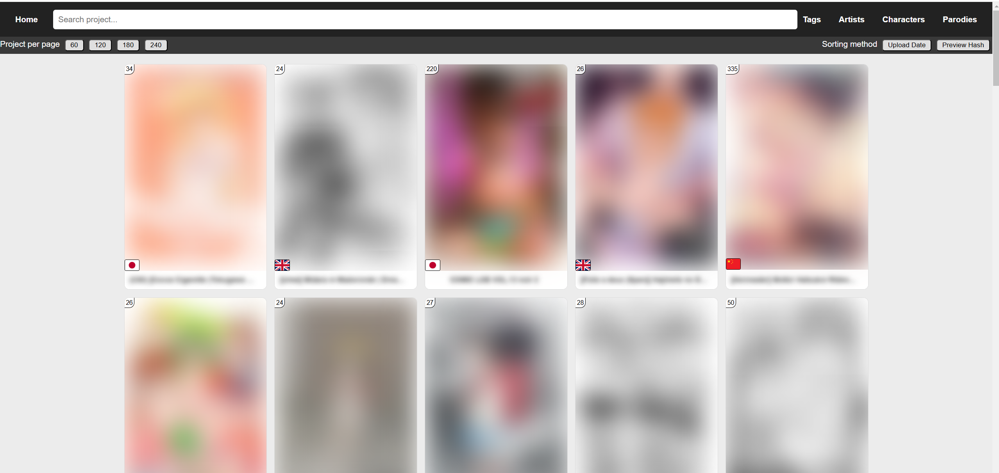
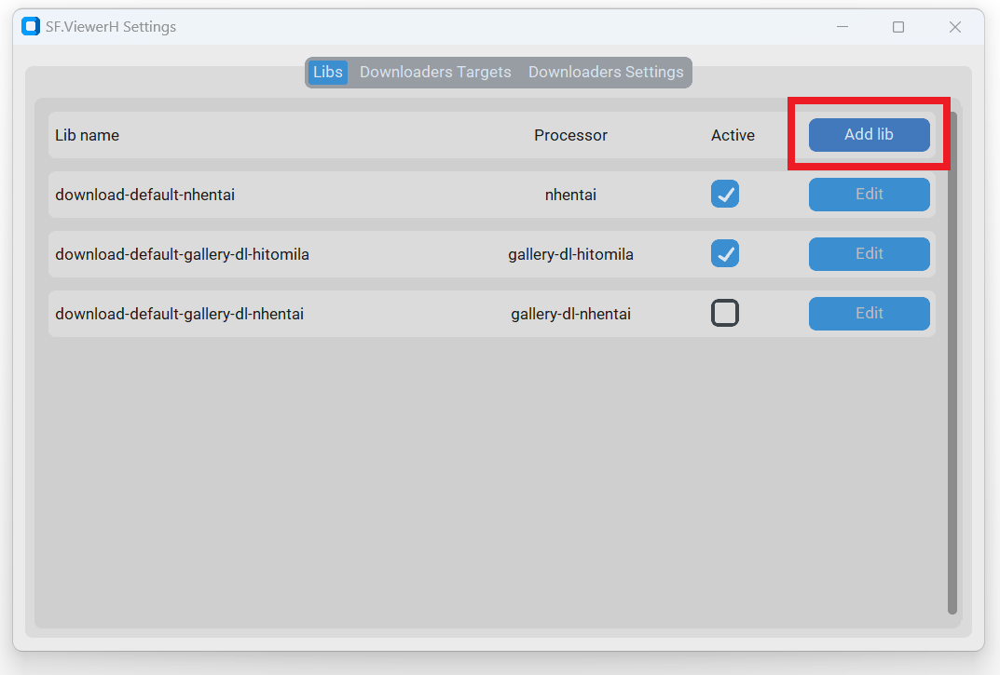
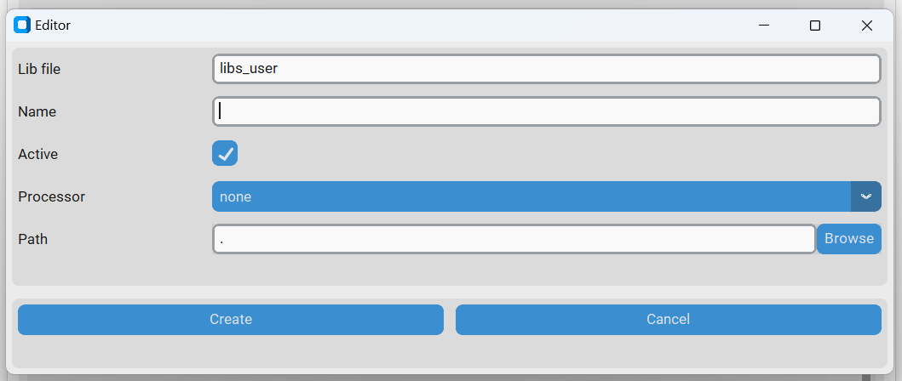
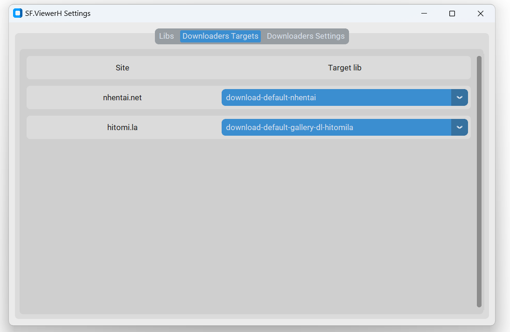
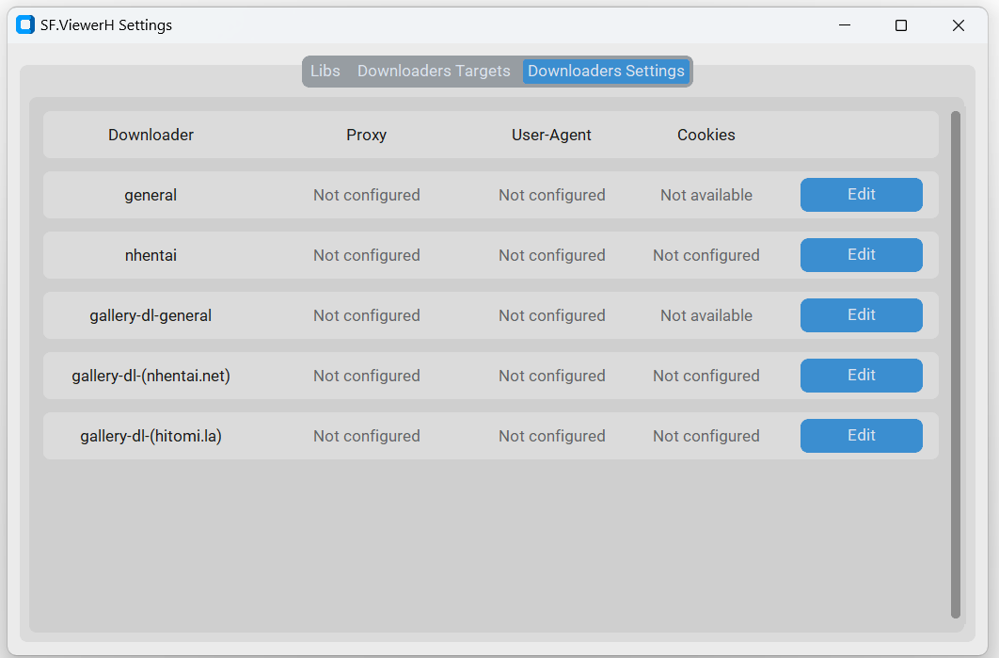
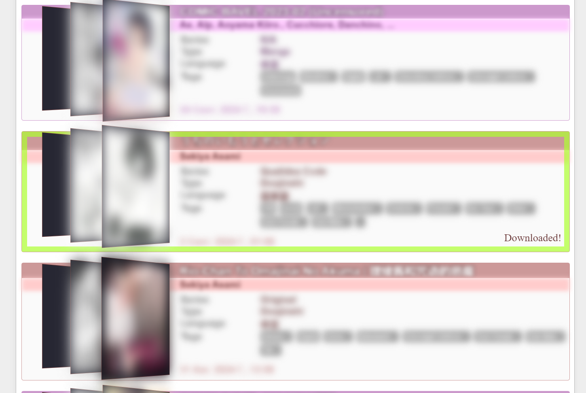

# SF.ViewerH

___
*Save your collection*



### Features:

- View projects from **nhentai.net** downloaded using [nhentai][1].
- View projects from **hitomi.la**, **nhentai.net** (and other **sites** in the future) downloaded
  using [gallery-dl][2].
- Browser extension that allows you to easily download an open project page from supported sites.
- Shows already uploaded projects directly on the website (hitomi.la)

### SV.ViewerH is a viewer for images uploaded via:

- [nhentai][1]
- [gallery-dl][2]

### Supports

| Site        | Supported downloader           | Extension (download)                      | Extension (extra)                      |
|-------------|--------------------------------|-------------------------------------------|----------------------------------------|
| nhentai.net | [nhentai][1] / [gallery-dl][2] | supported([nhentai][1] / [gallery-dl][2]) | none                                   |
| hitomi.la   | [gallery-dl][2]                | supported([gallery-dl][2])                | show already downloaded on the website |

### Install and run:

#### Way 1: Using standalone version
1. Download from releases
2. Unzip in any directory
3. Use settings.bat for set your directoro with downloads and select proper processor
4. Use update.bat for update application
5. Use run.bat for start application


#### Way 2: Using system python

```bash
git clone https://github.com/annihilation7071/SF.ViewerH.git
cd SV.ViewerH
pip install -r requirements.txt
app.py
```

#### Way 3: Using venv

```bash
git clone https://github.com/annihilation7071/SF.ViewerH.git
cd SV.ViewerH
python -m venv venv
./venv/scripts/activate
pip install -r requirements.txt
app.py
```

### How to start:

1. Upload files using [nhentai][1] or [gallery-dl][2].(```--write-info-json``` parameter **MUST** be used
   for [gallery-dl][2]. ```-meta``` parameter **MUST** be used for [nhentai][1])
2. Use **settings.bat** or **settingsui.py** to configure libs.
3. Use **run.bat** or **app.py**, the server IP address will appear in the terminal.
<br>




### Chrome-Extension

There is an extension for chromium-based browsers in the ```./extension directory```.
It can be installed via the browser extensions menu (*just **drag** the .crx into the extensions tab and
click **install***).
The extension simply downloads the open project to the library specified in **settings**.

<br>


*You can specify some additional downloader parameters*

<br>

---
There are two versions of the extension: **Lite** and **Extended**.

**Lite** does nothing except that when you click on the extension icon, it sends the application a link to the currently open page, after which the application tries to download the project from this page.

**Extended** also provides additional functions. At the moment, only one is implemented, this is the display of already downloaded projects on the hitomi.la website.



### Other

---

- Added a function to merge several projects into one.

For example, if you have one of the same project in several languages or in different quality, and you do not want to delete any of them.
<br>All you need to do is on the project page in the options specify the data of similar projects in this format.
<br>`LID:DESCRIPTION:p`<br>
Where **LID** is the **LID** from the project page, **DESCRIPTION** is any description, and **p** is the project that will be the main one. The rest of the projects must be in this format.
<br>`LID:DESCRIPTION`<br>
A new project will be created (virtual, without physical location), which is the main project with the combined tags from all projects. It will also be possible to switch between all projects.
<br>

[1]: https://github.com/RicterZ/nhentai

[2]: https://github.com/mikf/gallery-dl
